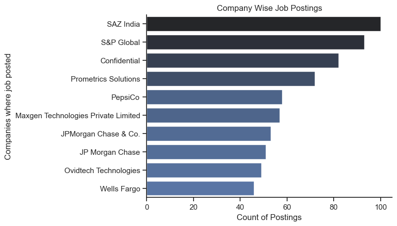
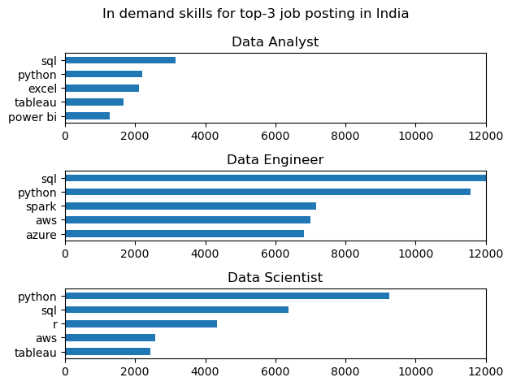

# OVERVIEW

Welcome to this Python project! This project explores a publicly available job postings dataset sourced from Kaggle, providing valuable insights into the current job market. Leveraging guidance from a Python for data analytics course by a knowledgeable YouTuber Mr. Luke Barousse, the primary objective is to uncover trends and patterns in the job market—helping aspiring data analysts and myself gain a competitive edge as they embark on their careers.

# LIBRARIES USED

The initial data import and basic exploration are performed using Pandas, allowing for efficient data manipulation and summary statistics. To visualize top skills, highest-paying positions, median salary trends, and the most frequently mentioned skills, the project uses Matplotlib for flexible plotting and Seaborn for more advanced, customizable visualizations. NumPy is utilized for numerical operations such as computing means, medians, outlier detection, and other key statistical calculations, helping to efficiently analyze large, multi-dimensional datasets and perform data transformation tasks.

# QUESTIONS WE TEND TO ANSWER

Q.1 Which Indian cities are emerging as hotspots for data analyst roles? Which companies are recruiting most regularly, and what types of work arrangements—on-site (WFO), remote (WFH), or hybrid—are most common in these job postings?

Q.2 Which skills are the most popular for the top three job roles in India's data field? What is the likelihood or frequency of these skills being mentioned in job postings?

Q.3 What is the likelihood of each skill being mentioned in job postings throughout the entire 12-month period?

Q.4 What is the median salary offered for the top three job roles posted in India? Additionally, what are the median salaries associated with the top ten individual skills, and how do these salaries compare relative to those mentioned in the job postings?

Q.5 Which skill offers the most optimal combination of a high median salary and a strong likelihood of being mentioned in job postings?

# ANALYSIS

QUESTION-1
~~~ python

import seaborn as sns
sns.set_theme(style='ticks')
sns.barplot(data=df_plot,x='count',y='job_location',hue='count',palette='dark:b_r',legend=False)
plt.xlabel('Count of Postings')
plt.ylabel('Cities where Job Posted')
plt.title('City Wise Illustration of Job Postings')
sns.despine()
plt.show()

~~~

~~~ python
fig , ax = plt.subplots(1,3)

dict_pie = {
    'job_work_from_home':'Work From Home',
    'job_no_degree_mention':'Degree Not Mentioned',
    'job_health_insurance': 'Insurance Offered'}

for i, (column, title) in enumerate(dict_pie.items()):
    counts = df_DA_India[column].value_counts()
    ax[i].pie(counts, startangle=90, autopct='%1.1f%%', labels=counts.index)
    ax[i].set_title(title)

~~~

~~~ python
df_plot = df_DA_India['company_name'].value_counts().to_frame().head(10)

sns.set_theme(style='ticks')
sns.barplot(data=df_plot,x='count',y='company_name',hue='count',palette='dark:b_r',legend=False)
plt.xlabel('Count of Postings')
plt.ylabel('Companies where job posted')
plt.title('Company Wise Job Postings')
sns.despine()
plt.show()
~~~

INSIGHTS: Hyderabad, Telangana, has emerged as the leading hotspot for data analyst roles in India, followed closely by flexible or remote positions listed as "Anywhere" and Bengaluru, Karnataka. Among the top recruiting companies, SAZ India, S&P Global, and Confidential dominate in terms of job postings, signifying their active hiring in the field. Regarding work arrangements, the majority of roles require on-site presence, with only about 17% of the positions offering work-from-home options, while hybrid roles are not explicitly addressed; notably, essential benefits such as insurance are rarely mentioned, and over a third of postings do not specify degree requirements. This suggests that while opportunities are geographically concentrated and driven by select employers, remote roles remain limited despite growing industry digitalization

QUESTION-2

~~~ python
fig, ax = plt.subplots(len(job_titles), 1)

if len(job_titles) == 1:
    ax = [ax]  

for i, job_title in enumerate(job_titles):
    df_plot = df_skills[df_skills['job_title_short'] == job_title].head(5)

    if df_plot.empty:
        print(f"Skipping '{job_title}' — no matching data.")
        continue

    df_plot.plot(kind='barh', x='job_skills', y='skill_count', ax=ax[i], title=job_title)
    fig.suptitle('In demand skills for top-3 job posting in India', fontsize=12)
    ax[i].legend().set_visible(False)
    ax[i].set_ylabel('')
    ax[i].set_xlim(0,12000)
    ax[i].invert_yaxis()

plt.tight_layout()
plt.show()
~~~

~~~ python
import seaborn as sns
sns.set_theme(style='ticks')

fig, ax = plt.subplots(len(job_titles), 1)

if len(job_titles) == 1:
    ax = [ax]  

for i, job_title in enumerate(job_titles):
    df_plot = df_merged[df_merged['job_title_short'] == job_title].head(5)
    sns.barplot(df_plot, x='perc of occur', y='job_skills', ax=ax[i], hue='skill_count', palette='dark:b_r')
    
   
    if i != len(job_titles) - 1:  
        ax[i].set_xticks([])

    fig.suptitle('Likelihood of skills for top-3 job posting in India', fontsize=12)
    ax[i].legend().set_visible(False)
    ax[i].set_ylabel('')
    ax[i].set_xlabel('')
    ax[i].set_xlim(0,75)
 
    for n,v in enumerate(df_plot['perc of occur']):
        ax[i].text(v+1,n,f'{v:.0f}%', va='center')
    ax[i].set_xticks([]) 
     
fig.tight_layout()
plt.show()
~~~

INSIGHTS: For the top three job roles in India’s data field—Data Analyst, Data Engineer, and Data Scientist—the most popular and in-demand skills are SQL and Python, both of which consistently appear across all roles with high frequency. Specifically, SQL is required in 52% of data analyst postings, 68% of data engineer positions, and 48% of data scientist jobs, while Python is mentioned in 36%, 61%, and 70% of these respective roles. Other noteworthy skills include Excel and Tableau for data analysts, Spark, AWS, and Azure for data engineers, and R, AWS, and Tableau for data scientists, albeit with lower likelihoods. This pattern highlights the critical importance of SQL and Python for anyone aspiring to enter or grow in India’s competitive data job market, as these skills are most frequently listed and strongly demanded by employers.

QUSETION-3

~~~ python
df_plot = df_final.iloc[:,:5]
sns.lineplot(df_plot,dashes=False, palette='tab10')

sns.set_theme(style='ticks')
sns.despine()
plt.title('Likelihood of Skills mentioned spread across months (%)')
plt.legend('')
plt.xlabel('Months')
plt.ylabel('% of occurance')

from matplotlib.ticker import PercentFormatter
ax = plt.gca()
ax.yaxis.set_major_formatter(PercentFormatter(decimals=0))

for i in range(5): 
    plt.text(11.5,df_plot.iloc[-1,i],df_plot.columns[i],va='center')

plt.show()
~~~

INSIGHTS: Over the 12-month period, Python and SQL maintained the highest and most consistent likelihood of being mentioned in job postings, each showing up in around 55–63% of listings across all months. Their mention rates remained closely aligned, with minor fluctuations but no significant seasonal dips, underscoring their sustained demand throughout the year. In contrast, skills like AWS, Azure, and Spark were noted less frequently, generally falling in the 20–30% range, with occasional marginal increases indicating short-lived shifts in employer preferences. Overall, Python and SQL are persistently valued by recruiters every month, while mentions for cloud and big-data technologies are lower and more variable

QUESTION-4

~~~ python
sns.boxplot(data=df_india_top_3,y='job_title_short',x='salary_year_avg',order=job_order)
sns.set_theme(style='ticks')
plt.title('Salary avgs w.r.t to Job Title')
plt.xlabel('Salary(USD)')
plt.ylabel('Job Titles')
ticks_x = plt.FuncFormatter(lambda x, pos: f'${int(x/1000)}k')
plt.gca().xaxis.set_major_formatter(ticks_x)
plt.xlim(0,600000)
plt.show()
~~~

~~~ python
fig , ax = plt.subplots(2,1)

df_top_skills.plot(kind='barh',
                       y='median',
                       ax=ax[0],
                       title='Frequency of Top 10 Skill & Median Salary',
                       legend=False)

df_top_pay.plot(kind='barh',
                      y='median',
                      ax=ax[1],
                      title='Median Salary of Top 10 skill for DA',
                      legend=False)

ax[0].invert_yaxis() 
ax[1].invert_yaxis() 

ax[0].set_xlim(0,160000) 

ax[0].set_ylabel('')  
ax[1].set_ylabel('')

ax[0].set_xlabel('Median Salary ($USD)')
ax[1].set_xlabel('Median Salary ($USD)')

ax[0].xaxis.set_major_formatter(plt.FuncFormatter(lambda x,pos:f'${int(x/1000)}K')) 
ax[1].xaxis.set_major_formatter(plt.FuncFormatter(lambda x,pos:f'${int(x/1000)}K'))

fig.tight_layout()
plt.show()
~~~

INSIGHTS: The median salary for the top three job roles in India shows clear differentiation: Data Engineers command the highest median salary, followed by Data Scientists, with Data Analysts earning comparatively less but still robust packages. When looking at specific skills, tools such as PySpark, Scala, Databricks, and advanced databases (like PostgreSQL, MongoDB, Neo4j) are associated with the highest median salaries, typically exceeding USD 120K, surpassing even the common, highly demanded skills such as SQL, Excel, and Python, which hover closer to the USD 100K mark. This pattern reveals that while foundational skills are widely requested and well-compensated, mastery of specialized, advanced technologies can lead to even more lucrative job offers in the Indian data job market.

QUESTION-5 

~~~ python
from adjustText import adjust_text
from matplotlib.ticker import FuncFormatter

df_top_skills.plot(kind='scatter',x='% of Occurance',y='median salary')
plt.xlabel('% of Occurance')
plt.ylabel('Median Salary (USD)')
plt.title('Most Optimal Skill for Data Analyst w.r.t Median Salary')

texts=[] 
for i, txt in enumerate(df_top_skills.index):
    texts.append(plt.text(df_top_skills['% of Occurance'].iloc[i],df_top_skills['median salary'].iloc[i],txt))

adjust_text(texts,arrowprops=dict(arrowstyle='->', color='grey', lw=1.5))  

ax = plt.gca()
ax.yaxis.set_major_formatter(plt.FuncFormatter(lambda y,pos:f'${int(y/1000)}K'))

from matplotlib.ticker import PercentFormatter
ax.xaxis.set_major_formatter(PercentFormatter(decimals=0))
 
plt.tight_layout()
plt.show()
~~~

INSIGHTS: Among data analyst skills, SQL provides the most optimal balance between a high median salary (close to $96K USD) and a strong likelihood of being mentioned in job postings (around 11%), making it both lucrative and widely sought after. While specialized tools like Power BI and Tableau offer even higher median salaries, their frequency in postings is much lower, making SQL the best choice for maximizing both demand and earning potential simultaneously.

# KEY TAKEAWAY FROM PROJECT

I was able to do this project with somewhat difficulty since I come from non computer science background, however I learnt the basic concepts and did the most sensible project of analysing the job market for this field, I took the help of my friends, youtube tutorials and of-course gpt models to quickly overcome the challenges while understanding their cause of the error.

Here are my key takeaways :
The Indian data analytics job market is centered in Hyderabad and Bengaluru, but remote roles remain rare. SQL and Python are the most sought-after and frequently mentioned skills, while specialized tools like Power BI and Tableau command higher salaries but are less commonly required. Median salaries are highest for data engineers and for roles requiring advanced technologies, but the optimal balance of employability and income remains with SQL. Skill mentions and salary trends are remarkably stable across the year, making steady upskilling in SQL and Python the smartest strategy for aspiring data analysts entering this competitive landscape.

